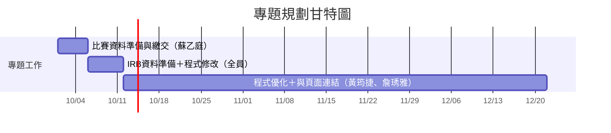

# 小組作業2：專題任務規劃

## 專題名稱

帕金森氏症居家語音檢測 App

## 專題規劃期間

**開始時間：2026/10/01**  
**結束時間：2026/12/21**

## 一、組員任務分配

| 課程組員 | 負責任務 |
|---|---|
| 林家誼 | 語音分析模型 |
| 賴湘詅 | 應用程式介面製作 |
| 蔡可心 | 應用程式介面製作 |

## 二、專案階段規劃

| 時間 | 工作內容 | 主要負責人 |
|---|---|---|
| 10/1～10/5 | 比賽資料準備與繳交 | 蘇乙庭 |
| 10/6～10/11 | IRB資料準備、程式修改 | 黃筠捷、詹琇雅、蘇乙庭 |
| 10/12～12/21 | 程式優化、與頁面連結 | 黃筠捷、詹琇雅 |

## 三、專題甘特圖

## 四、PERT/CPM 圖

專題工作依照目前規劃時間依序進行，先完成比賽資料準備與繳交，再進行IRB資料準備及程式修改，最後進行程式優化與頁面連結。實際執行時程將依專題進度、測試結果及需求調整，後續規劃可能隨執行情況進行修正。
