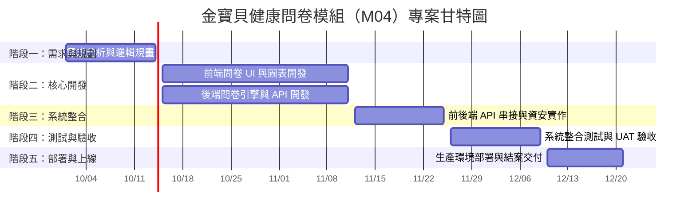

# 金寶貝健康問卷模組（M04）專案規劃

## 1. 專案個別組員的任務

| 職位 / 角色 | 姓名 | 主要負責任務 | 
| :--- | --- | :--- |
| **系統分析與專案管理(SA/PM)** | 林家誼 | 1. 訪談健康問卷需求與設計跳轉邏輯<br>2. 管控專案進度與團隊溝通 | 
| **前端開發工程師(Frontend)** | 賴湘詅 | 1. 開發問卷動態表單與介面動畫<br>2. 實作問卷結果分析圖表元件 | 
| **後端與測試工程師(Backend/QA)** | 蔡可心 | 1. 設計問卷資料庫與建置計分引擎 API<br>2. 執行系統整合測試與資安驗證 | 

---

## 2. 專案甘特圖 (Gantt Chart)

專案執行期間為 **10/01 至 12/21（共 12 週）**：

| 階段 / 週次 | 任務內容 | 負責角色 | 預計時間 |
| :--- | :--- | :---: | :---: |
| **Phase 1 (W1-W2)** | 需求分析、問卷邏輯規畫與 DB Schema 設計 | SA/PM | 10/01 - 10/14 |
| **Phase 2 (W3-W6)** | 前端問卷 UI 開發與後端計分引擎 API 寫作 | FE, BE | 10/15 - 11/11 |
| **Phase 3 (W7-W8)** | 前前後端 API 串接與資料加密安全性實作 | FE, BE | 11/12 - 11/25 |
| **Phase 4 (W9-W10)** | 全系統功能測試、壓測與 UAT 驗收 | BE/QA | 11/26 - 12/09 |
| **Phase 5 (W11-W12)** | 生產環境部署上線與專案結案文件 | 全員 | 12/10 - 12/21 |



## 3. PERT / CPM 關鍵路徑分析

### 任務節點與時程分析表

* **專案總工期**：12 週（10/01 ~ 12/21）
* **關鍵路徑**：`A → B → D → F → G`
* **路徑說明**：關鍵路徑總時長為 **12 週**，此路徑上的任何任務延誤都將直接導致最終交付時間延後。

| 節點 | 任務名稱 | 負責角色 | 工期 (週) | 前置任務 | 最早開始/完成 (ES/EF) | 最晚開始/完成 (LS/LF) | 總浮時 (TF) | 關鍵路徑 |
| :---: | :--- | :---: | :---: | :---: | :---: | :---: | :---: | :---: |
| **A** | 需求分析與問卷邏輯規畫 | SA/PM | 2 | - | W0 / W2 | W0 / W2 | 2 週 | **是** |
| **B** | 後端問卷引擎與 API 開發 | Backend | 4 | A | W2 / W6 | W2 / W6 | 4 週 | **是** |
| **C** | 前端問卷 UI/UX 畫面開發 | Frontend | 4 | A | W2 / W6 | W2 / W6 | 4 週 | 否 |
| **D** | 前後端 API 串接與資安實作 | FE / BE | 2 | B, C | W6 / W8 | W6 / W8 | 2 週 | **是** |
| **E** | 測試案例撰寫與環境準備 | Backend | 2 | A | W2 / W4 | W6 / W8 | 2 週 | 否 |
| **F** | 系統整合測試與 UAT 驗收 | 全體 | 2 | D, E | W8 / W10 | W8 / W10 | 2 週 | **是** |
| **G** | 生產環境部署與結案交付 | 全體 | 2 | F | W10 / W12 | W10 / W12 | 2 週 | **是** |

---

### PERT 網路圖 (Mermaid)

```mermaid
graph LR
    %% 節點定義
    A[A: 需求與邏輯規畫<br/>工期: 2週]
    B[B: 後端 API 開發<br/>工期: 4週]
    C[C: 前端 UI 開發<br/>工期: 4週]
    E[E: 測試案例撰寫<br/>工期: 2週]
    D[D: 前後端串接與資安<br/>工期: 2週]
    F[F: 系統測試與 UAT<br/>工期: 2週]
    G[G: 部署與結案交付<br/>工期: 2週]

    %% 任務依賴關係
    A --> B
    A --> C
    A --> E
    B --> D
    C --> D
    D --> F
    E --> F
    F --> G

    %% 關鍵路徑高亮標示 (紅色邊框與粉紅背景)
    style A fill:#ffe6e6,stroke:#ff0000,stroke-width:2px
    style B fill:#ffe6e6,stroke:#ff0000,stroke-width:2px
    style D fill:#ffe6e6,stroke:#ff0000,stroke-width:2px
    style F fill:#ffe6e6,stroke:#ff0000,stroke-width:2px
    style G fill:#ffe6e6,stroke:#ff0000,stroke-width:2px
